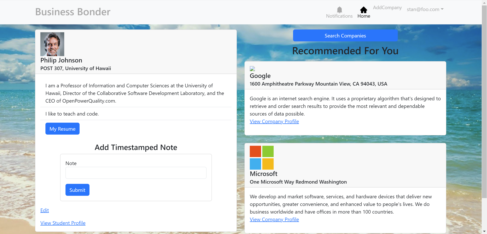
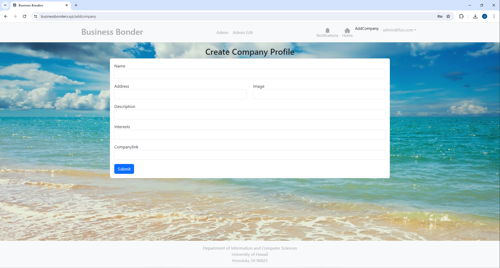

  
  

The problem: Many UH computer science and engineering students want to learn about internship and job opportunities, but currently they must wait until a company decides to visit the campus or send out some sort of announcement. There is no efficient way for students to understand the “landscape” of internship and job opportunities that might be available in the future, so they can prepare for them now.

The solution: The Company Connector web application provides a new way for local and non-local companies who want to recruit students from UH to make their (potential) opportunities known to students. At the same time, students can create profiles on the site with their interests. The site can match students to employers and vice-versa.

### Overview
The development journey of our project, tentatively named the "Company Connector," has been an exciting endeavor aimed at addressing a critical challenge faced by University of Houston (UH) computer science and engineering students. Our vision was to create a platform where students could easily access internship and job opportunities while providing companies with a streamlined process to connect with potential candidates. Drawing inspiration from LinkedIn, our team embarked on designing a web application that would serve as a bridge between students and employers, enhancing the recruitment process for both parties.

Despite our best efforts, we encountered challenges along the way that prevented us from completing the project as envisioned. However, throughout the development process, we remained committed to our goal of creating a user-friendly and efficient platform for the UH community. While our project may not have reached its final form, we strived to incorporate elements inspired by LinkedIn, leveraging its features and functionalities as a reference point.

Had we been able to complete the project, the final version would have resembled a scaled-down version of LinkedIn, tailored specifically to the needs of UH students and local/national companies looking to recruit from this talent pool. Just as LinkedIn provides a comprehensive platform for professionals to network and explore career opportunities, our platform aimed to offer a similar experience but within the context of the UH ecosystem.

Source: <a href="https://business-bonder.github.io/"><i>Project Homepage</i></a>

Source: <a href="https://businessbonders.xyz/"><i>Project Site</i></a>

Source: <a href="https://github.com/Business-Bonder"><i>GitHub Project Organization</i></a>

###### Acknowledgement: AI tools such as ChatGPT and other Online Resources were used to provide information and insights as well as help with grammar, vocabulary and punctuation.
